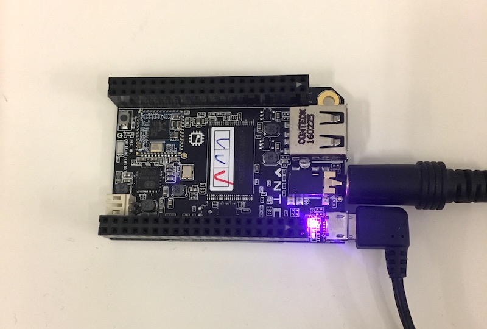
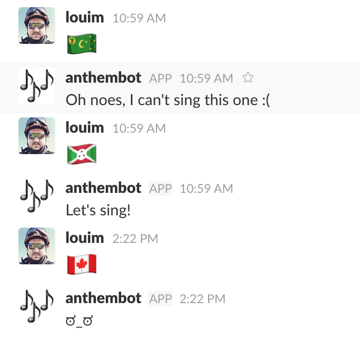

# AnthemBOT
**AnthemBOT** is a SlackBot that listen to Slack for countries flag emoji 🇨🇦 in the `:flag-ca:` format, and play the country national anthem.



## How it works
The bot was created to run on a Linux board (I'm currently running it on a [C.H.I.P.](https://getchip.com/pages/chip)), and should run on most Linux distros.

The bot is made with [Botkit](https://github.com/howdyai/botkit)

The bot listens to direct messages, mentions, other bots messages, in the channels where he is a member. It looks for country flag emoji (or the text version).

When a flag emoji trigger the bot, it uses the two letter country code to play a midi `.mid` file using **TiMidity++**.

For example, `:flag-ca:` will play the `ca.mid` file.

## How to setup the bot

### Creating the bot

First, [create a new bot in your slack](https://my.slack.com/services/new/bot). We will need the token to make **AnthemBOT** connect to slack.

More info about bots can be found here: [https://api.slack.com/bot-users](https://api.slack.com/bot-users)

### Intalling required dependencies

You will need **[Node.js](https://nodejs.org/)** to run the bot. Make sure that you have it installed. In the bot folder run:

```
npm install
```

Install **Timidity++** and a soundfont to play the midi files:

```
sudo apt-get install timidity
sudo apt-get install fluid-soundfont-gm fluid-soundfont-gs
```

Enable the soundfont by editing the TiMidity config: `sudo nano /etc/timidity/timidity.cfg`

The bottom of the file should look like this, with the freepats commented out and the fluid uncommented: 

```
# By default, try to use the instrument patches from freepats:
# source /etc/timidity/freepats.cfg

# alternatively, you can use the fluid-soundfont:
source /etc/timidity/fluidr3_gm.cfg
source /etc/timidity/fluidr3_gs.cfg
```

### Getting the midi anthem files

You will need to download the midi files for each countries, and place them in the `media` folder. They are not included in the repository because I'm not sure of the copyright.

For example, you could get them using the following command:

```
cd media
curl -JLO --referer http://www.download-midi.com http://www.download-midi.com/files/download/[8892-9026]
```

Included in the utils folder is a simple **Ruby** script that you can use to mass rename the files to their two letters name.

```
cd utils
gem install countries
ruby rename.rb
```
## Running the bot

### The config

The bot has 3 required params to start correctly:

```
ALLOWED_USERS='userid1 userid2'
ALLOWED_BOTS='botid1'
TOKEN='slack_token'
```

The parameters are pretty much self explanatory. `ALLOWED_USERS` and  `ALLOWED_BOTS` are space separated user or bot ids allowed to interact with AnthemBOT. `TOKEN` is the Slack toke you created in the first step. There is an optional `DEBUG='true'` param that can be used to enable verbose logging. Params should be fed to the bot via the environment.

### Starting the bot

How you run the bot is up to you. I strongly recommend running with a process manager to handle environment injection, restarts, monitoring and logging.  There is an example [PM2](http://pm2.keymetrics.io/) config file included (`ecosystem.config.js.example`).

To use PM2 config file:

```
cp ecosystem.config.js.example ecosystem.config.js
```

Edit the file to add your config and then start the bot with:

```
pm2 start ecosystem.config.js
```

If all is well, should see the bot come online in your Slack

#### This is what it looks like:

* First answer is when it can't find a file matching the country
* Second answer is playing the requested anthem
* Third answer is when a user or bot that is not allowed try to trigger it



## Contributing

Pull request with improvements are very much welcome!

© Louis-Michel Couture 2017
